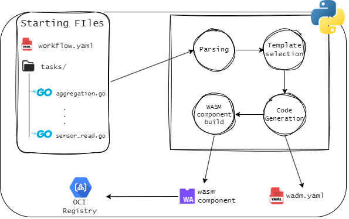

# PELATO: Progettazione ed Esecuzione di Lifecycle Automatizzati per Tecnologie WebAssembly ed Orchestrazione 

# Infrastuttura

L'infrastuttura simula un flusso IoT ed è composta da:
- ambiente Cloud, deployato su kubernetes e dotato di cluster NATS, WADM e Wasmcloud Host 
- ambiente Edge, semplice macchina Linux con docker compose, Wasmcloud e NATS Leaf come docker container
- dispositivi IoT collegati all'ambiente Edge


# Pipeline

Il processo si divide in due fasi principali, cioè quello di generazione del componente wasm e quella di deploy.

## Generazione del componente WASM

Questa fase si occupa di trasformare una serie di files descrittivi in codice, selezionare il template corretto, buildare il progetto, generare il file di deploy e quindi pushare l'artifact OCI in un registry.

### Parsing del codice

Il progetto di partenza è composto da un file `workflow.yaml`, nel quale vengono descritti tutti i componenti, e da una cartella `tasks` contenente le porzioni di codice che devono essere eseguite dai vari componenti.

```
├─ workflow.yaml
└─ tasks
   ├─ sensor_read.go
   ├─ aggregate.go
   └─ db_sync.go
```

#### Workflow
Nel file workflow vengono descritti i vari componenti, un esempio potrebbe essere

```yaml
tasks:
  - name: Data Aggregation                # Displayed name
    type: processor_nats                      # Used to select template
    code: aggregate.go                    # Go code file inside tasks/ dir
    target:                               # Where the component will be deployed
      - edge
      - cloud
    source_topic: temp_sensor             # Source NATS topic
    dest_topic: aggregated_data           # Destination NATS topic
    component_name: data_aggregation      # Component name displayed in the OCI artifact
    version: 1.0.0                        # Component version
...
```
#### Task files

I file con il codice all'interno della cartella `task` devono seguire il formato

```go
package main

import (

)

func exec_task(arg string) string{

	... your code ...

	return response   // must me string
}
```

### Generazione del codice

Il parser utilizza il campo `type` del workflow per selezionare il corretto template fra quelli implementati (per ora)
- producer_nats -- produzione di dati e scrittura di essi in un topic NATS
- processor_nats -- lettura di dati da un topic, processamento dei dati e scrittura su un altro topic
- dbsync_nats -- lettura di dati da un topic e scrittura su un DB (Postgres)

Viene sostituito il file delle task con quello del template, i campi del file `workflow` vengono utilizzati per compilare il file `wadm.yaml`.

### Build componente WASM

Viene utilizzato il Dockerfile del template per buildare il componente WASM e pusharlo al registry configurato utilizzando il nome e la versione specificati nel `workflow.yaml`


## Deploy componenti WASM su Wasmcloud

In fase di deployment vengono utilizzati i file `wadm.yaml` compilati in precedenza per effettuare il deployment dell'applicazione, eccone un esempio

```yaml
apiVersion: core.oam.dev/v1beta1
kind: Application
metadata:
  name: go-data-stream
  annotations:
    description: 'Data stream processing using NATS topic in Golang (TinyGo), using the WebAssembly Component Model and WebAssembly Interfaces Types (WIT)'
    wasmcloud.dev/authors: Lorenzo Venerandi
    wasmcloud.dev/source-url: https://github.com/UniBO-PRISMLab/PELATO/src/code_generator/templates/processor_nats.git/wadm.yaml
    wasmcloud.dev/readme-md-url: https://github.com/UniBO-PRISMLab/PELATO/src/code_generator/templates/processor_nats.git/README.md
    wasmcloud.dev/homepage: https://github.com/UniBO-PRISMLab/PELATO/src/code_generator/templates/processor_nats.git
    wasmcloud.dev/categories: |
      stream-processing,nats-client,tinygo,golang
spec:
  components:
    - name: go_stream_processor
      type: component
      properties:
        image: github.com/UniBO-PRISMLab/PELATO/src/code_generator/templates/processor_nats:1.0.3
        id: stream
        config: 
          - name: nats-topic
            properties: 
              dest-topic: wasmcloud.echo.reply
      traits:
        - type: spreadscaler
          properties:
            instances: 1
            spread:
            - name: cloud
              weight: 100
              requirements:
                host-type: cloud
            - name: edge
              weight: 0
              requirements:
                host-type: edge
        - type: link
          properties:
            target: nats
            namespace: wasmcloud
            package: messaging
            interfaces: [consumer]
    - name: nats
      type: capability
      properties:
        image: ghcr.io/wasmcloud/messaging-nats:0.23.1
      traits:
        - type: link
          properties:
            target: go_stream_processor
            namespace: wasmcloud
            package: messaging
            interfaces: [handler]
            source_config:
              - name: simple-subscription
                properties:
                  subscriptions: streaming
        - type: spreadscaler
          properties:
            instances: 1
            spread:
            - name: cloud
              weight: 100
              requirements:
                host-type: cloud
            - name: edge
              weight: 0
              requirements:
                host-type: edge
```
Il target del deployment viene selezionato tramite il campo `spreadscaler`, che indirizza i componenti nell'host con il tag corrispondente.

### Pipeline scheme
